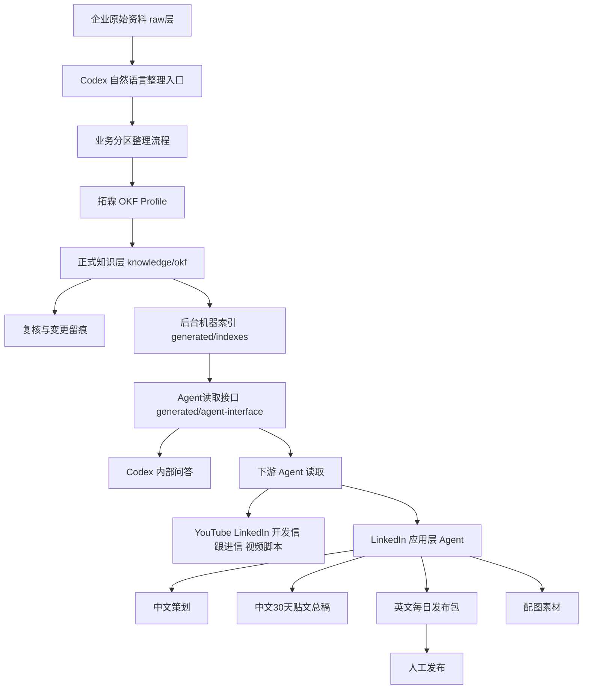
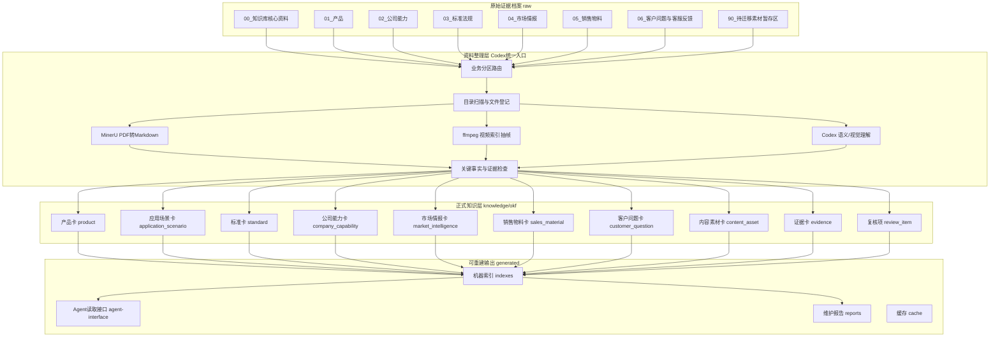
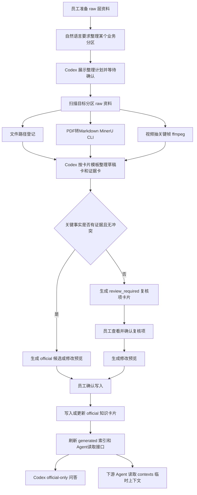
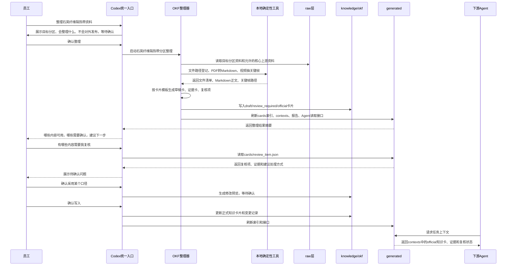

# 拓霖 Agent 2.0 本地知识库系统 PRD

**版本：v2.0 draft-4 | 日期：2026年6月17日 | 编制：产品经理**

------

## 版本记录

| 版本 | 日期 | 变更内容 |
| --- | --- | --- |
| v2.0 draft | 2026-06-15 | 基于 1.14 现状和 OKF 方案重新定义 2.0：以 OKF 知识卡片作为正式知识层，`raw/` 作为原始证据档案，`generated/` 作为可重建输出；保留 Codex 唯一入口、业务分区、人工复核和下游 Agent 读取边界 |
| v2.0 draft-2 | 2026-06-15 | 补齐 10 类知识卡片口径、分区摘要字段、核心资料上游队列、`usage_scope` 和证据可信度枚举；明确 MinerU Markdown 写入 generated cache；补充自然语言推荐、待处理分区和更新知识库用例 |
| v2.0 draft-3 | 2026-06-15 | 明确新仓库定位为 `tuolin-marketplace`，用于承载拓霖全部 Agent；知识库是其中一个 Agent；首期只支持通过 Codex 客户端安装和使用，不提供用户侧独立 CLI 产品；必须支持 Windows 员工安装和使用 |
| v2.0 draft-4 | 2026-06-17 | 增补 LinkedIn 应用层 Agent：在同一 `tuolin-marketplace` 中，通过 Agent读取接口生成 30 天 LinkedIn 中文策划、中文贴文总稿、英文发布包和配图素材；不扫描 raw、不写回正式知识层、不自动发布 |

------

## 术语表

| 术语 | 说明 |
| --- | --- |
| raw层 | 企业原始文件目录，按业务分类存放 PDF、DOCX、XLSX、图片、视频、Markdown 等未整理资料 |
| 原始证据档案 | raw层在 2.0 中的定位；系统可以读取和引用，但不得静默移动、改名、删除或把它当成可重建输出 |
| OKF | Open Knowledge Format，一种以 Markdown 文件、YAML frontmatter 和普通链接表示知识的开放格式思想；本项目只采用其文件格式思想，不接入 Google 云服务或参考工程运行时 |
| 拓霖OKF Profile | 拓霖在 OKF 基础上定义的业务规范，固定卡片类型、必填字段、标题规则、正文栏目、状态机、证据规则和复核规则 |
| 知识卡片 | `knowledge/okf/` 下的一份 Markdown 文件，表示一个产品、应用场景、标准、公司能力、市场情报、销售物料、客户问题、内容素材、证据或复核项 |
| 正式知识层 | 2.0 的长期知识维护层，存放在 `knowledge/okf/`；Codex 问答、后台索引和下游 Agent 读取接口都从这里派生 |
| 关键事实 | 可能影响对外承诺、客户判断、产品选型、合规、报价或内容发布的信息，必须具备证据来源或人工确认记录 |
| 证据来源 | 支撑关键事实的原始资料位置或人工确认记录，例如 raw 文件路径、页码、截图路径、视频帧时间点、复核确认记录 |
| 复核项 | 因知识冲突、资料不完整、关键事实缺少证据、对象命名不确定、来源可信度或时效不确定、适用范围不清、对外表达存在风险、数值/单位/翻译存在歧义、AI 无法判断，或新知识会改变已有正式口径而生成的待人工确认问题 |
| 卡片状态 | 知识卡片生命周期状态：`draft`（草稿）、`review_required`（需要复核）、`official`（正式可用）、`archived`（已归档）。`archived` 表示历史保留或废弃内容，不进入默认问答和下游 Agent 上下文，只用于追溯过往口径、复核过程或资料演变 |
| 业务分区 | raw 层按业务用途划分的一组资料目录。每个分区对应一类明确资料，例如产品资料、公司能力、标准法规、市场情报、销售物料、客户问题或待迁移素材 |
| 核心产品 | 拓霖耐高温隔热带业务中的五个固定产品分区：陶瓷纤维隔热带、石英纤维隔热带、玄武岩纤维隔热带、高硅氧纤维隔热带_有背胶、高硅氧纤维隔热带_无背胶 |
| 公司能力分区 | 从公司介绍、生产车间、企业资质和实验室资料中沉淀公司能力卡的业务分区 |
| 市场情报分区 | 从市场现状与平台调研、竞争对手、潜在客户、网页价格资料库和历史调研资料中沉淀市场情报卡的业务分区 |
| 销售物料分区 | 从 Datasheet、报价资料、开发信与跟进、产品手册与说明文档、多语言销售资料中沉淀销售物料卡的业务分区；它不等同于市场研究 |
| 客户问题/客服反馈分区 | 从原始客服记录和已归类问题素材中沉淀客户问题卡的业务分区；它不属于公司介绍，也不能直接覆盖产品事实 |
| 待迁移素材暂存区 | 目标 raw 层中 `raw/90_待迁移素材暂存区/` 的定位；暂存区按待归入产品素材、公共内容素材、公司能力素材、历史成片与项目文件、待人工判定分拣，不作为长期业务分区 |
| 跨产品公共素材 | 不属于单一产品、但可服务多个产品或通用内容表达的资料，例如通用安装教程、材料对比、石棉风险、通用 FAQ、整体性能对比、公共拍摄素材 |
| generated层 | 系统自动生成的文件夹，存放检索文件、报告和给 Agent 读取的资料；可删除后重新生成，不需要人工维护 |
| Agent读取接口 | Codex 问答和下游 Agent 读取正式知识的固定入口；目的是让 Agent 读取整理后的知识卡片，而不是直接翻 raw 原始资料 |
| 应用层 Agent | 基于 Agent读取接口生产业务交付物的 Agent，不直接扫描 raw，也不维护正式知识层 |
| LinkedIn 活动 | 围绕一个产品、受众、卖点和周期生成的领英发帖策划与发布素材包 |
| 对外产品名 | 公开渠道使用的产品名称，可不同于知识库内部产品名 |
| 本次人工确认卖点 | 用户在一次内容生产任务中明确确认、但尚未沉淀为正式知识的对外卖点 |
| 画面 tags | 叠加在配图上的短卖点标签，由每日贴文主题派生 |
| LinkedIn hashtags | 英文发布正文末尾的平台主题标签，用于帮助内容被相关行业话题发现 |
| Codex客户端 | OpenAI 本地 Agent 客户端，是拓霖 Agent 的安装、使用、语义/视觉理解、复核交互和自然语言入口 |
| Codex唯一入口 | 首期所有模型/API能力都经由 Codex 客户端触发；不得要求员工额外配置独立模型 API key |
| tuolin-marketplace | 未来 GitHub 仓库名，定位为拓霖 Agent 市场，承载知识库、内容、销售、视频等多个 Tuolin Agent；知识库只是其中一个 Agent |
| 用户侧 CLI | 普通员工直接在命令行中调用的独立产品形态；2.0 首期不支持。MinerU、ffmpeg 等本地 CLI 只能作为 Codex 背后的内部工具使用 |
| 知识库项目目录 | 员工实际管理本地资料、正式知识和生成结果的唯一工作目录，包含 `config/`、`raw/` 或 raw 绝对路径配置、`knowledge/okf/`、`generated/` |

------

## 1. 产品要解决的核心问题

拓霖已有大量产品、标准、市场、客户问题、销售物料和视频素材，但这些资料分散在 raw 层文件夹中，无法被员工、Codex 问答和下游业务 Agent 稳定复用。

2.0 要解决的问题是：把本地原始资料整理成可维护、可追溯、可复用的正式知识卡片，并用 Agent读取接口提供给内部问答、开发信、LinkedIn、YouTube、视频脚本等 Agent 使用。

核心约束：

- 不让 Agent 每次从 260GB raw 资料中重新找答案。
- 不让销售物料、客服对话、视频素材直接污染产品事实。
- 冲突、不完整、缺少证据的内容必须进入复核，不能直接作为正式知识。
- 员工通过中文自然语言使用系统，不需要理解 OKF、检索文件或技术细节。

------

## 2. 产品核心价值

拓霖 Agent 2.0 的价值不是“整理文件”，而是把散落在本地的产品、客户、市场和销售资料，变成员工和业务 Agent 都能稳定使用的企业知识。

它必须带来四个直接结果：

- 员工问产品、客户问题、标准、报价和销售资料时，不再临时翻文件。
- 开发信、LinkedIn、YouTube、视频脚本等 Agent 使用同一套资料，不再各写各的口径。
- 产品事实、销售表达、客服反馈、市场线索分清来源，不能互相污染。
- 缺证据、冲突、不确定的内容先让人确认，再进入可用知识。

知识库 2.0 首期只做知识整理、复核和读取入口。后续应用层 Agent 可以基于 Agent读取接口生产 LinkedIn、开发信、视频脚本等业务交付物，但不得绕过知识库的正式知识、证据和复核边界。

LinkedIn 应用层 Agent 只做策划、文案、翻译、配图素材和人工发布准备，不做账号授权、自动排程或自动发布。

**仓库与运行边界：**

- 新仓库命名为 `tuolin-marketplace`，用于承载拓霖全部 Agent。
- 本地知识库是 `tuolin-marketplace` 中的一个 Agent，不代表整个仓库只有知识库。
- 普通员工只通过 Codex 客户端安装和使用 Agent。
- 首期不提供用户侧独立 CLI 产品；维护脚本和本地工具只能作为 Codex 背后的内部实现。
- 必须支持 Windows 员工安装和使用，包括依赖检查、路径配置和本地工具调用。

------

## 3. 架构设计

### 3.1 业务架构图



### 3.2 技术架构图



### 3.3 项目目录设计

```text
tuolintec/
├── config/
│   ├── tuolin-kb.config.json
│   └── tuolin-okf-profile/
│       ├── profile.yaml
│       └── card-templates/
│           ├── product.yaml
│           ├── application_scenario.yaml
│           ├── standard.yaml
│           ├── company_capability.yaml
│           ├── market_intelligence.yaml
│           ├── sales_material.yaml
│           ├── customer_question.yaml
│           ├── content_asset.yaml
│           ├── evidence.yaml
│           └── review_item.yaml
├── raw/
│   ├── 00_知识库核心资料/
│   ├── 01_产品/
│   ├── 02_公司能力/
│   ├── 03_标准法规/
│   ├── 04_市场情报/
│   ├── 05_销售物料/
│   ├── 06_客户问题与客服反馈/
│   └── 90_待迁移素材暂存区/
├── knowledge/
│   └── okf/
│       ├── 首页.md
│       ├── 产品/
│       ├── 应用场景/
│       ├── 标准法规/
│       ├── 公司能力/
│       ├── 市场情报/
│       ├── 销售物料/
│       ├── 客户问题/
│       ├── 内容素材/
│       ├── 证据/
│       ├── 复核项/
│       └── 变更记录.md
└── generated/
    ├── indexes/
    ├── agent-interface/
    ├── reports/
    └── cache/
```

**目录职责：**

| 目录 | 职责 | 是否人工长期维护 |
| --- | --- | --- |
| `config/tuolin-okf-profile/` | 保存卡片类型、必填字段、状态规则和模板版本 | 是，但只由维护者修改 |
| `raw/` | 保存原始资料和证据附件 | 是，但只维护原始资料 |
| `knowledge/okf/` | 保存正式知识卡片 | 是，是 2.0 主知识层 |
| `generated/` | 保存检索文件、Agent读取接口、报告和缓存 | 否，可删除后重建 |

### 3.4 raw 层目录设计

raw 层按业务用途分区。新增资料应直接放入对应业务目录；暂时无法判断归属或价值的，放入 `90_待迁移素材暂存区/90_待人工判定/`，等待人工确认。

raw 层只保存企业原始资料和人工维护资料。MinerU 生成的 PDF Markdown 不写回 raw 层，默认写入 `generated/cache/pdf-markdown/`，并保留原始 raw 相对路径，便于追溯。

```text
/raw
├── 00_知识库核心资料/
│   ├── 01_产品核心资料/
│   ├── 02_产品对比资料/
│   ├── 03_客服常用回答/
│   └── 04_公共内容素材/
│       ├── 通用安装教程/
│       ├── 材料对比/
│       ├── 石棉与安全风险/
│       ├── 通用FAQ/
│       └── 公共拍摄素材/
├── 01_产品/
│   ├── 01_陶瓷纤维隔热带/
│   │   ├── 01_检测报告与认证/
│   │   ├── 02_产品图片/
│   │   ├── 03_产品视频/
│   │   ├── 04_应用场景素材/
│   │   └── 05_测试验证素材/
│   ├── 02_石英纤维隔热带/
│   │   ├── 01_检测报告与认证/
│   │   ├── 02_产品图片/
│   │   ├── 03_产品视频/
│   │   ├── 04_应用场景素材/
│   │   └── 05_测试验证素材/
│   ├── 03_玄武岩纤维隔热带/
│   │   ├── 01_检测报告与认证/
│   │   ├── 02_产品图片/
│   │   ├── 03_产品视频/
│   │   ├── 04_应用场景素材/
│   │   └── 05_测试验证素材/
│   ├── 04_高硅氧纤维隔热带_有背胶/
│   │   ├── 01_检测报告与认证/
│   │   ├── 02_产品图片/
│   │   ├── 03_产品视频/
│   │   ├── 04_应用场景素材/
│   │   └── 05_测试验证素材/
│   └── 05_高硅氧纤维隔热带_无背胶/
│       ├── 01_检测报告与认证/
│       ├── 02_产品图片/
│       ├── 03_产品视频/
│       ├── 04_应用场景素材/
│       └── 05_测试验证素材/
├── 02_公司能力/
│   ├── 01_公司介绍/
│   ├── 02_生产车间/
│   │   ├── 陶瓷纤维生产车间/
│   │   ├── 纺纱/
│   │   ├── 织带/
│   │   ├── 织布/
│   │   ├── 混棉/
│   │   └── 包装/
│   ├── 03_企业资质/
│   └── 04_实验室/
├── 03_标准法规/
│   ├── 01_中国标准/
│   └── 02_国际标准/
├── 04_市场情报/
│   ├── 01_市场现状与平台调研/
│   ├── 02_竞争对手/
│   │   └── [竞品品牌名]/
│   │       ├── 产品资料/
│   │       ├── 价格资料/
│   │       ├── 网站截图/
│   │       └── 社媒资料/
│   ├── 03_潜在客户/
│   │   ├── 00_客户名录/
│   │   └── [客户品牌名]/
│   │       ├── 公司资料/
│   │       ├── 产品资料/
│   │       ├── 价格资料/
│   │       ├── 网站截图/
│   │       ├── 社媒资料/
│   │       └── 询盘与联系记录/
│   ├── 04_网页价格资料库/
│   │   └── [站点或品牌名]/
│   │       ├── 页面截图/
│   │       ├── 价格截图/
│   │       └── 原始网页文件/
│   └── 05_历史调研资料/
├── 05_销售物料/
│   ├── 01_Datasheet/
│   ├── 02_报价资料/
│   │   ├── 报价原则/
│   │   └── 报价单/
│   ├── 03_开发信与跟进/
│   ├── 04_产品手册与说明文档/
│   └── 05_多语言销售资料/
│       ├── 英文/
│       ├── 日文/
│       └── 中英日对照/
├── 06_客户问题与客服反馈/
│   ├── 01_原始客服记录/
│   │   ├── 抖店2023/
│   │   └── 淘宝2024/
│   └── 02_已归类问题素材/
│       ├── 产品规格与配件/
│       ├── 材料对比与选型/
│       ├── 冒烟异味/
│       ├── 扎手掉毛/
│       ├── 安装长度/
│       ├── 耐温与安全/
│       ├── 防锈腐蚀/
│       └── 购买与本地自取/
└── 90_待迁移素材暂存区/
    ├── 01_待归入产品素材/
    ├── 02_待归入公共内容素材/
    ├── 03_待归入公司能力素材/
    ├── 04_历史成片与项目文件/
    └── 90_待人工判定/
```

### 3.5 knowledge/okf 目录设计

```text
knowledge/okf/
├── 首页.md
├── 产品/
│   ├── 陶瓷纤维隔热带.md
│   ├── 石英纤维隔热带.md
│   ├── 玄武岩纤维隔热带.md
│   ├── 高硅氧纤维隔热带_有背胶.md
│   └── 高硅氧纤维隔热带_无背胶.md
├── 应用场景/
├── 标准法规/
│   ├── 中国标准/
│   └── 国际标准/
├── 公司能力/
│   ├── 公司介绍/
│   ├── 生产车间/
│   ├── 企业资质/
│   └── 实验室/
├── 市场情报/
│   ├── 市场现状与平台调研/
│   ├── 竞争对手/
│   ├── 潜在客户/
│   ├── 网页价格资料库/
│   └── 历史调研资料/
├── 销售物料/
│   ├── Datasheet/
│   ├── 报价资料/
│   ├── 开发信与跟进/
│   ├── 产品手册与说明文档/
│   └── 多语言销售资料/
├── 客户问题/
│   ├── 产品规格与配件/
│   ├── 材料对比与选型/
│   ├── 冒烟异味/
│   ├── 扎手掉毛/
│   ├── 安装长度/
│   ├── 耐温与安全/
│   ├── 防锈腐蚀/
│   └── 购买与本地自取/
├── 内容素材/
│   ├── 通用安装教程/
│   ├── 材料对比/
│   ├── 石棉与安全风险/
│   ├── 通用FAQ/
│   └── 公共拍摄素材/
├── 证据/
│   ├── 产品/
│   ├── 标准法规/
│   ├── 公司能力/
│   ├── 市场情报/
│   ├── 销售物料/
│   └── 客户问题/
├── 复核项/
│   ├── 产品/
│   ├── 标准法规/
│   ├── 市场情报/
│   ├── 销售物料/
│   └── 客户问题/
└── 变更记录.md
```

**命名规则：**

- 一级目录由拓霖 OKF Profile 固定，目录下的知识卡片可以动态新增、合并和归档。
- 业务可见目录和卡片文件名使用中文，方便员工维护。
- 卡片内部 `id` 使用英文稳定标识，只允许英文、数字、下划线、短横线和斜杠。
- 中文标题放在文件名、`title` 字段和正文中。
- raw 层的图片、视频、PDF 不复制到 `knowledge/okf/`；知识卡片只引用 raw 路径或证据卡。
- AI 可以提出标题候选，但不能直接决定长期标题。
- 新产品、新标准、新客户场景、疑似重复对象必须进入复核。
- `首页.md` 和 `变更记录.md` 是可重建导航文件，不作为产品事实或证据来源。正式知识写入不得依赖对这两个文件的脆弱补丁匹配。
- 当 `首页.md` 或 `变更记录.md` 因旧编码、内容损坏或补丁上下文不匹配导致无法增量修改时，系统必须自动备份旧文件到 `generated/cache/navigation-backups/`，重建导航文件，并继续写入正式知识卡。

### 3.6 知识卡片结构

所有知识卡片都采用“基础字段 + 专属字段 + 正文”的结构。基础字段保证系统能识别、检索、复核；专属字段由每类卡自己的模板定义；正文写业务内容和证据说明。

下面只展示通用基础字段。产品卡的 `product_line`、`related_refs` 等专属字段见 3.8；完整产品卡示例见 3.9。

```yaml
---
card_template_version: product-card-v1
type: product
id: product/quartz_fiber_tape
title: 石英纤维隔热带
aliases:
  - 白色石英纤维隔热带
  - quartz fiber exhaust wrap
status: official
usage_scope: external_allowed
raw_partitions:
  - raw/00_知识库核心资料/
  - raw/01_产品/02_石英纤维隔热带/
tags: [产品, 隔热带, 石英纤维]
updated_at: 2026-06-15T00:00:00+08:00
last_reviewed_at: 2026-06-15T00:00:00+08:00
evidence_refs:
  - evidence/product/quartz_fiber_tape_test_report
review_refs: []
---
```

**所有卡通用基础字段：**

| 字段 | 必填 | 说明 |
| --- | --- | --- |
| `card_template_version` | 是 | 卡片按哪一版模板整理，例如 `product-card-v1` |
| `type` | 是 | 卡片类型 |
| `id` | 是 | 英文稳定标识，不随中文文件名或标题变化 |
| `title` | 是 | 中文业务标题 |
| `aliases` | 否 | 常见别名、英文名、平台叫法或客户叫法 |
| `status` | 是 | `draft`、`review_required`、`official`、`archived` |
| `usage_scope` | 是 | 使用范围：可对外、仅内部、需复核后对外、仅作证据或不可回答 |
| `raw_partitions` | 是 | 主要来源 raw 分区，可以有多个 |
| `tags` | 否 | 中文标签 |
| `updated_at` | 是 | 最近更新时间 |
| `last_reviewed_at` | 否 | 最近一次人工确认时间；`official` 卡建议填写 |
| `evidence_refs` | 否 | 关联证据卡 |
| `review_refs` | 否 | 关联复核项；为空表示当前无阻塞复核 |

**`usage_scope` 枚举：**

| 值 | 中文 | 说明 |
| --- | --- | --- |
| `external_allowed` | 可对外使用 | 可用于客户沟通、销售资料和下游内容，但仍需保留证据口径 |
| `internal_only` | 仅内部使用 | 只能用于内部理解、培训或判断，不直接对客户表达 |
| `review_before_external` | 对外前需复核 | 可作为内容草稿参考，但发布或发给客户前必须人工确认 |
| `evidence_only` | 仅作证据 | 只作为证据来源读取，不直接作为问答答案或销售表达 |
| `not_answerable` | 不可回答 | 不进入默认问答和下游 Agent 上下文，只保留作记录或追溯 |

### 3.7 知识卡片类型

| type | 中文名 | 用途 | 默认是否可给下游 Agent 使用 |
| --- | --- | --- | --- |
| `product` | 产品卡 | 产品定义、规格、卖点、应用、限制条件 | 仅 `official` 可用 |
| `application_scenario` | 应用场景卡 | 使用场景、适配产品、客户需求、限制条件和可用素材 | 仅 `official` 可用 |
| `standard` | 标准卡 | 标准编号、适用范围、测试要求、合规口径 | 仅 `official` 可用 |
| `company_capability` | 公司能力卡 | 产能、设备、认证、实验室、定制、交付能力 | 仅 `official` 可用 |
| `market_intelligence` | 市场情报卡 | 行业、地区、平台、竞品、潜在客户、价格和机会 | 仅 `official` 可用 |
| `sales_material` | 销售物料卡 | 报价原则、Datasheet、开发信、产品手册、多语言销售资料 | 仅 `official` 可用 |
| `customer_question` | 客户问题卡 | 真实客户问题、售前异议、FAQ、客服回复建议 | 仅 `official` 可用；不得单独覆盖产品事实 |
| `content_asset` | 内容素材卡 | 可复用的安装教程、材料对比、FAQ、公共拍摄素材和历史内容素材 | 仅 `official` 可用；不得单独覆盖产品事实 |
| `evidence` | 证据卡 | 原始文件能证明什么、来源位置、解析状态 | 可作为证据读取 |
| `review_item` | 复核项卡 | 冲突、不完整、缺证据或需要人工判断的问题 | 默认不可作为事实使用 |

首期共 10 类知识卡片。`首页.md` 和 `变更记录.md` 是导航与记录文件，不计入知识卡片类型。AI 不得自行创造新的核心类型。确需新增类型时，必须先更新拓霖 OKF Profile。

### 3.8 卡片模板配置

卡片模板配置放在 `config/tuolin-okf-profile/card-templates/`。它定义每类卡必须有哪些字段、哪些字段可以为空、默认状态是什么、哪些字段必须人工复核。

配置文件只定义模板，不存放真实知识。真实知识卡片仍写入 `knowledge/okf/`。

普通员工不需要、也不应该手动配置卡片模板。Codex 初始化本地知识库项目时，必须自动创建 `config/tuolin-okf-profile/profile.yaml` 和 10 类卡片模板。如果模板缺失，系统不得把自由 Markdown 当成正式知识卡片。

正式知识卡片的业务可见标题必须使用中文：包括文件名、`title` 字段和用户可见整理结果。英文产品名、英文报告名、平台英文叫法只能进入 `id`、`aliases`、证据说明或原始路径，不得作为主标题。

```text
config/tuolin-okf-profile/
├── profile.yaml
└── card-templates/
    ├── product.yaml
    ├── application_scenario.yaml
    ├── standard.yaml
    ├── company_capability.yaml
    ├── market_intelligence.yaml
    ├── sales_material.yaml
    ├── customer_question.yaml
    ├── content_asset.yaml
    ├── evidence.yaml
    └── review_item.yaml
```

修改规则：

- 普通员工不直接修改模板配置。
- 维护者可以修改模板，但必须同步更新 `card_template_version`。
- Codex 生成或修改知识卡片时，必须先读取对应模板。
- Codex 整理完成前必须校验卡片结构并刷新 Agent读取接口；校验失败时不得向用户报告“已整理完成”。
- `knowledge/okf/` 根目录只允许 `首页.md` 和 `变更记录.md`；产品、证据、复核等正式知识必须写入对应的 10 类卡片目录。
- 导航文件修复属于系统内部恢复动作，不需要普通员工确认；恢复完成后只需报告正式卡片写入结果和是否产生复核项。
- 模板变更不自动改旧卡；旧卡需要升级时，先生成升级预览，人工确认后再写入。

**10 类卡专属字段：**

| 卡片类型 | 专属字段 | 设计目的 |
| --- | --- | --- |
| 产品卡 | `product_line`、`related_refs` | 标明产品线，并关联标准、应用场景、客户问题和销售物料 |
| 应用场景卡 | `scenario_category`、`related_products`、`usable_channels` | 描述场景、适配产品和可用于哪些内容渠道 |
| 标准卡 | `standard_region`、`standard_code`、`related_products`、`applicability_notes` | 区分中国/国际标准，记录标准编号、关联产品和已确认适用说明 |
| 公司能力卡 | `capability_area` | 区分公司介绍、车间、资质、实验室等能力来源 |
| 市场情报卡 | `intelligence_type`、`market_region`、`data_time_range`、`related_products` | 区分市场报告、竞品、潜在客户、价格资料和资料时效 |
| 销售物料卡 | `material_type`、`language`、`related_products` | 区分 Datasheet、报价、开发信、手册、多语言资料 |
| 客户问题卡 | `question_category`、`customer_channel`、`related_products`、`response_status` | 沉淀真实客户问题、来源渠道、关联产品和回复是否可复用 |
| 内容素材卡 | `asset_category`、`media_types`、`related_products`、`usable_for` | 管理安装教程、材料对比、公共拍摄素材、历史内容等复用边界 |
| 证据卡 | `evidence_type`、`source_paths`、`proves`、`confidence` | 说明原始资料是什么、在哪里、能证明什么、可信程度 |
| 复核项卡 | `review_reason`、`affected_cards`、`decision_options`、`blocking_level` | 说明为什么要人工确认、影响哪些卡、可选处理方式和阻塞程度 |

### 3.9 产品卡示例

```markdown
---
card_template_version: product-card-v1
type: product
id: product/quartz_fiber_tape
title: 石英纤维隔热带
aliases:
  - 白色石英纤维隔热带
  - 石英纤维排气管隔热带
  - quartz fiber exhaust wrap
status: official
usage_scope: external_allowed
product_line: 耐高温隔热带
raw_partitions:
  - raw/00_知识库核心资料/
  - raw/01_产品/02_石英纤维隔热带/
tags: [产品, 隔热带, 石英纤维]
updated_at: 2026-06-15T00:00:00+08:00
last_reviewed_at: 2026-06-15T00:00:00+08:00
evidence_refs:
  - evidence/product/quartz_fiber_tape_test_report
related_refs:
  standards:
    - standard/gb_t_3003
  application_scenarios:
    - application_scenario/indoor_exhaust_pipe
  customer_questions:
    - customer_question/smoke_and_odor
review_refs: []
---

# 产品定义

石英纤维隔热带是拓霖耐高温隔热带产品之一，用于高温管路、排烟管和出口场景的隔热包覆。

# 关键参数

| 参数 | 数值 | 证据 |
| --- | --- | --- |
| 材质 | 石英纤维 | [产品基础资料](../../raw/00_知识库核心资料/产品基础资料.md) |
| 厚度 | 2mm | [检测报告](../evidence/quartz_tape_2024_test_report.md) |

# 应用场景

- 室内排烟管
- 家用热水器
- 出口外贸

# 不适用或限制条件

暂无已确认限制条件。若后续资料出现冲突，必须进入复核项。

# 对外表达口径

可表达为“适合对气味、烟雾和舒适度要求更高的室内及出口场景”。该表述必须保留证据引用。

# 证据

- [2024检测报告-石英纤维隔热带](../evidence/quartz_tape_2024_test_report.md)

# 关联知识

- [GB/T 3003](../标准法规/GB_T_3003.md)

# 变更记录

- 2026-06-15：从历史核心资料迁移为 2.0 产品卡。
```

### 3.10 卡片状态机

| 状态 | 中文 | 说明 | 是否进入默认问答/下游接口 |
| --- | --- | --- | --- |
| `draft` | 草稿 | AI 初步整理，尚未完成校验或复核 | 否 |
| `review_required` | 需要复核 | 存在冲突、缺证据、不完整或需人工判断 | 否 |
| `official` | 正式可用 | 已确认、可追溯、可被复用 | 是 |
| `archived` | 已归档 | 历史保留或废弃内容，不进入默认问答和下游 Agent 上下文，只用于追溯过往口径、复核过程或资料演变 | 否 |

状态规则：

- 新生成卡片默认不得直接进入 `official`，除非全部关键事实都有明确证据且无冲突。
- `review_required` 内容不能作为确定事实回答。
- `archived` 内容只用于历史追溯。
- 下游 Agent 默认只读取 `official` 内容和相关证据卡。

### 3.11 关键事实与证据规则

关键事实定义：

> 凡是可能被用于对外承诺、客户判断、产品选型、合规、报价或内容发布的信息，都属于关键事实。

关键事实包括：

- 产品材质、厚度、宽度、耐温、背胶/非背胶、用途、限制条件。
- 标准编号、适用范围、测试结论、合规表述。
- 公司产能、认证、设备、交付能力、定制能力。
- 销售物料中可被客户看到的产品参数、卖点、承诺和限制条件。
- 应用场景中会影响客户选型或使用判断的适配关系。

证据规则：

- 关键事实必须链接到证据卡或人工确认记录；证据卡再指向 raw 原始文件。
- AI 综合推断出的卖点，如果没有明确证据，不得进入正式知识卡片。
- 冲突事实必须生成复核项，不得自动选择一个口径。
- 市场情报、客户问题和内容素材不能单独证明产品事实，只能作为线索、素材或复核输入。
- 图片和视频默认只证明“画面中出现了什么”；要证明产品性能、认证、耐温、环保或安全结论，必须另有检测报告、标准原文或人工确认。
- 非关键的组织性文字、章节说明和内部整理备注可以不逐条证据化，但不得夹带关键事实。

**证据卡 `confidence` 枚举：**

| 值 | 中文 | 使用规则 |
| --- | --- | --- |
| `high` | 高可信 | 原始资料直接证明该事实，且无冲突 |
| `medium` | 可参考 | 原始资料能支持该事实，但仍需要结合其他证据或上下文使用 |
| `low` | 低可信 | 来源较弱、时效不明、截图不完整或 AI 判断不充分，默认进入复核 |
| `unusable` | 不可使用 | 文件无法解析、证据无法定位、内容与事实无关或已经废弃 |

### 3.12 generated 输出设计

```text
generated/
├── indexes/
│   ├── cards.json
│   ├── links.json
│   └── search_index.json
├── agent-interface/
│   ├── manifest.json
│   ├── cards/
│   │   ├── product.json
│   │   ├── application_scenario.json
│   │   ├── standard.json
│   │   ├── company_capability.json
│   │   ├── market_intelligence.json
│   │   ├── sales_material.json
│   │   ├── customer_question.json
│   │   ├── content_asset.json
│   │   ├── evidence.json
│   │   └── review_item.json
│   ├── contexts/
│   └── manifest_summary.json
├── reports/
│   ├── BUILD_REPORT.md
│   └── REVIEW_REPORT.md
└── cache/
    ├── pdf-markdown/
    └── video-frames/
```

生成原则：

- `generated/` 是编译产物，不人工直接编辑。
- 删除 `generated/` 后，应能从 `knowledge/okf/` 和必要 raw 证据重新生成。
- `agent-interface/` 是下游 Agent 的默认读取边界。
- `agent-interface/cards/` 按 10 类卡输出机器可读索引，不新增知识、不改写卡片事实。
- `agent-interface/contexts/` 按任务临时组合上下文，例如产品问答、开发信、LinkedIn、YouTube、视频脚本。
- `contexts/` 由 Agent 读取请求按需生成或刷新；当相关知识卡片、证据卡、复核项或分区状态变化时，对应上下文必须失效并重新生成。
- `contexts/` 只保存任务上下文，不保存新的正式知识；任何上下文结论都不能反向写入 `knowledge/okf/`。
- 证据卡和复核项也是知识卡片，统一放在 `agent-interface/cards/evidence.json` 和 `agent-interface/cards/review_item.json`，不再单独建立重复目录。

### 3.13 Agent读取接口

Agent读取接口至少支持：

| 能力 | 说明 |
| --- | --- |
| 查看知识状态 | 读取 `manifest.json` 和 `manifest_summary.json`，返回 10 类卡数量、分区状态、待继续查看素材数、已识别待入卡数量、待复核数量和推荐下一步 |
| 按卡片类型读取 | 从 `cards/` 读取产品、应用场景、标准、公司能力、市场情报、销售物料、客户问题、内容素材、证据和复核项 |
| 按问题检索 | 基于 `indexes/search_index.json` 返回相关正式卡片和证据卡，不默认返回草稿和待复核内容 |
| 查证据 | 根据关键事实返回证据卡，再由证据卡追溯到 raw 原始文件 |
| 查看待复核 | 从 `cards/review_item.json` 返回复核项、影响卡片和可选处理方式 |
| 生成任务上下文 | 从 `contexts/` 读取或生成临时上下文，供产品问答、开发信、LinkedIn、YouTube、视频脚本使用 |

LinkedIn 任务上下文规则：

- `linkedin_post` 默认读取产品卡、应用场景卡和销售物料卡。
- 为了生成配图素材包，`linkedin_post` 可以读取内容素材卡。
- 内容素材卡只能用于选择真实素材、生成画面说明和配图 brief，不能证明耐温、安全、无烟、不刺痒等产品事实。
- LinkedIn 应用层 Agent 必须从当前知识库项目目录的 Agent读取接口获取上下文，不得绕过接口扫描 raw。

下游 Agent 不允许：

- 直接扫描 260GB raw 层。
- 绕过 Agent读取接口自行拼接知识上下文。
- 自行绕过卡片状态机使用待复核内容。
- 自行解释证据规则。
- 把 `generated/` 里的上下文结果写回 `knowledge/okf/` 当正式知识。

------

## 4. 业务流程图



------

## 5. 时序图



------

## 6. 业务分区与处理规则

### 6.1 首期业务分区

| 分区 | 类型 | raw 路径 | 主要知识卡片 |
| --- | --- | --- | --- |
| 陶瓷纤维隔热带 | 产品 | `raw/01_产品/01_陶瓷纤维隔热带/` | 产品卡、应用场景卡、内容素材卡、证据卡、复核项 |
| 石英纤维隔热带 | 产品 | `raw/01_产品/02_石英纤维隔热带/` | 产品卡、应用场景卡、内容素材卡、证据卡、复核项 |
| 玄武岩纤维隔热带 | 产品 | `raw/01_产品/03_玄武岩纤维隔热带/` | 产品卡、应用场景卡、内容素材卡、证据卡、复核项 |
| 高硅氧纤维隔热带_有背胶 | 产品 | `raw/01_产品/04_高硅氧纤维隔热带_有背胶/` | 产品卡、应用场景卡、内容素材卡、证据卡、复核项 |
| 高硅氧纤维隔热带_无背胶 | 产品 | `raw/01_产品/05_高硅氧纤维隔热带_无背胶/` | 产品卡、应用场景卡、内容素材卡、证据卡、复核项；当前资料缺少内容时标记为资料不完整 |
| 公司能力 | 知识域 | `raw/02_公司能力/` | 公司能力卡、证据卡 |
| 标准法规 | 知识域 | `raw/03_标准法规/` | 标准卡、证据卡 |
| 市场情报 | 知识域 | `raw/04_市场情报/` | 市场情报卡、证据卡、复核项 |
| 销售物料 | 知识域 | `raw/05_销售物料/` | 销售物料卡、证据卡、复核项 |
| 客户问题/客服反馈 | 知识域 | `raw/06_客户问题与客服反馈/` | 客户问题卡、证据卡、复核项 |
| 待迁移素材暂存区 | 人工判定暂存 | `raw/90_待迁移素材暂存区/` | 不直接生成正式知识卡片；先人工确认归入产品、公共内容或公司能力 |

### 6.2 处理规则

- 整理或更新必须明确目标业务分区。
- “整理一下拓霖知识库”不能直接扫描 260GB raw 层，应先推荐一个最有业务价值的下一步。
- “从头整理”必须拆成多个业务分区逐个处理，每个分区完成后刷新状态。
- 产品分区必须包含具体产品名称，不允许执行泛产品整理。
- 产品 raw 目录缺失时，该产品分区保持未整理状态，不得用核心资料降级生成产品卡。
- `raw/00_知识库核心资料/` 是产品、客服回复和公共内容的上游资料，不作为长期业务分区整理；产品分区可以读取它，其他跨分区读取默认禁止。
- 用户要求“阅读核心资料”或“继续看核心资料”时，系统使用“核心资料上游队列”处理其中的文字、图片、PDF 和视频；处理结果必须路由到受影响的产品卡、客户问题卡、内容素材卡、证据卡或复核项，不能生成一个长期“核心资料分区”。
- 核心资料中的内容如果能明确归属某个产品，则计入对应产品分区摘要；如果属于跨产品公共内容，则计入内容素材；如果无法判断归属或会改变已有正式口径，则生成复核项。
- 应用场景卡优先从产品分区的应用场景素材、客户问题和销售物料中提取；涉及产品适配关系时必须引用产品卡或人工确认。
- 内容素材卡只记录可复用素材边界，不单独证明产品事实。
- 客户问题/客服反馈分区可以链接到产品卡和销售物料卡，但客户对话只能作为“真实问题与异议”的证据；其中的产品事实、性能承诺和安全/合规表述必须由产品卡、标准卡、检测报告或人工确认支撑后才能进入 `official`。
- 销售物料分区可以复用产品卡和市场情报卡，但报价、开发信和 Datasheet 中的新口径不得静默反写产品卡；发现不一致时生成复核项。
- 目标分区的原始资料发生变化时，应先更新该分区，再继续复核或下游使用。

### 6.3 分区状态

| 状态 | 中文 | 说明 |
| --- | --- | --- |
| `not_started` | 未整理 | 分区尚未生成知识卡片，或必需 raw 目录缺失 |
| `ready` | 可用 | 分区已生成可读取的正式知识卡片 |
| `needs_update` | 需要更新 | raw 层存在新增、删除或修改，需要按分区重新整理 |
| `pending_review` | 待复核 | 分区存在需要人工确认的复核项 |
| `incomplete_materials` | 资料不完整 | 产品目录存在但资料不足，需要补充资料 |

如果一个分区同时满足多个状态，按以下优先级取最高状态：

```text
not_started > needs_update > incomplete_materials > pending_review > ready
```

不设置 `building`、`failed`、`partial` 等运行态状态。整理失败、单文件失败或解析失败写入报告和复核项，不作为长期分区状态。

**分区摘要字段：**

分区状态只表达当前最高优先级状态；自然语言推荐下一步时，还必须读取以下摘要字段。

| 字段 | 说明 | 用途 |
| --- | --- | --- |
| `pending_material_count` | 该分区还有多少图片、PDF、视频或其他素材没继续看 | 判断是否推荐“继续看资料” |
| `recognized_unapplied_count` | 已识别出内容，但还没有整理成正式知识卡片的数量 | 判断是否推荐“整理成可用资料” |
| `review_item_count` | 该分区待人工确认的复核项数量 | 判断是否推荐用户先复核 |
| `last_raw_changed_at` | 最近一次 raw 资料变化时间 | 判断是否需要更新 |
| `last_organized_at` | 最近一次整理完成时间 | 展示状态和判断资料是否过期 |
| `recommended_next_action` | 系统根据当前状态给出的下一步动作 | 供“整理一下拓霖知识库”和“查看当前还有哪些分区需要继续整理”使用 |

`recommended_next_action` 只允许使用这些值：`update_first`、`organize_usable`、`continue_reading`、`review_required`、`use_existing`、`prepare_raw`。

------

## 7. PDF、图片与视频处理边界

### 7.1 PDF

- PDF 原文件保留在 raw 层，作为原始证据附件。
- PDF 正文整理优先读取 raw 层中人工提供的同目录同名 Markdown。
- 缺少人工 Markdown 时，首期默认由本机 MinerU CLI 转换；转换结果写入 `generated/cache/pdf-markdown/`，不写回 raw 层。
- MinerU 是 Codex 背后的本地确定性工具；首期只走本机 CLI，不部署服务端，也不得配置独立模型 API key 或外部云服务。
- MinerU 不可用或转换失败时，只阻塞该 PDF 正文整理，不编造内容，不阻塞同分区其他资料。

### 7.2 图片

- 图片可以作为产品图、应用图、报告扫描页、资质图片、市场截图或竞品截图。
- 图片中的关键事实必须通过 Codex 理解后进入证据卡或复核项。
- 不能仅凭文件名生成关键事实。
- LinkedIn 对外配图优先使用 `official` 且 `external_allowed` 的真实内容素材。
- 图片和视频素材不能单独证明产品性能事实，只能支持外观、场景、构图和内容素材说明。
- LinkedIn 配图可以叠加透明 logo 和每日主题画面 tags。
- 第一版要求用户提供独立透明 logo 文件；参考图只作为版式样例，不自动裁切 logo。
- 没有可用真实素材时，只生成配图 brief 和 AI 作图提示，不把 AI 图伪装成产品实拍。

### 7.3 视频

- 视频主要服务未来脚本、分镜和剪辑选材。
- 默认只登记视频路径和执行索引抽帧，不把视频作为产品事实确认来源。
- 视频抽帧必须使用项目配置里的 ffmpeg；配置为绝对路径时必须使用该路径，不能因为 PATH 或 shell 环境不确定而跳过。
- 只有用户明确要求视频、剪辑、分镜或视频文案分析时，Codex 才读取关键帧并生成视觉描述。
- 视频关键帧描述如要进入对外内容素材，必须保留证据和复核状态。

------

## 8. 自然语言入口

普通员工必须使用中文自然语言，不需要记忆命令。系统要把用户的话路由到业务分区、知识卡片、复核项和 Agent读取接口，不把内部文件名、任务文件或模板字段暴露给普通员工。

### 8.1 日常入口

**整理核心资料：**

- “阅读一下知识库核心资料，整理进知识库。”
- “有需要我确认的内容，请先列出来让我确认；确认后再整理。”
- “不要移动、删除或重命名原始资料。”
- “不要直接写入正式知识卡片，除非我明确确认。”

系统处理规则：`raw/00_知识库核心资料/` 是上游资料，不作为长期业务分区；用户要求整理核心资料时，系统走核心资料上游队列，提出会影响哪些产品卡、客户问题卡或内容素材卡，并在写入 `knowledge/okf/` 前展示修改预览。

**整理知识库但未指定分区：**

- “整理一下拓霖知识库。”
- “请推荐一个最有价值的下一步，并给我一条可以直接复制的确认回复。”
- “执行前等我确认。”

系统处理规则：这不是全库整理，也不是完整状态报表。系统先查看分区状态，按业务价值推荐一个最有价值的下一步，并等待用户确认。

推荐优先级：

1. raw 资料有变化时，先推荐更新对应分区。
2. 已识别但未整理进可用资料时，推荐“整理成可用资料”。
3. 存在需要人工确认的内容时，推荐先处理复核项。
4. 还有图片、PDF、视频没看完时，推荐“继续看资料”。
5. 没有待处理内容时，切换到问答使用，并给出一条可复制问题示例。

**查看待处理内容：**

- “查看当前还有哪些分区需要继续整理。”

系统处理规则：只列出还需要动作的分区，并给出一个推荐下一步和可复制确认回复；不要输出完整技术状态报表。

**查看整体状态：**

- “查看知识库状态。”

系统处理规则：可以展示完整分区状态、10 类卡数量、待复核数量和最近更新时间。状态回答仍使用业务语言，不展示 `manifest`、`tasks.json`、`frontmatter` 等内部术语。

**从头整理或全量整理：**

- “从头整理拓霖知识库。”
- “重新整理拓霖知识库。”
- “全量整理拓霖知识库。”

系统处理规则：这类请求必须先拆成业务分区队列，并等待用户确认；即使用户说“全量”，也不得直接无边界扫描 raw 层。

### 8.2 按分区整理

产品分区：

- “整理石英纤维隔热带资料。”
- “整理陶瓷纤维隔热带资料。”
- “整理玄武岩纤维隔热带资料。”
- “整理高硅氧纤维隔热带资料。”
- “整理高硅氧纤维隔热带_有背胶资料。”
- “整理高硅氧纤维隔热带_无背胶资料。”

知识域分区：

- “整理公司资料。”
- “整理标准资料。”
- “整理市场资料。”
- “整理销售物料。”
- “整理客户问题和客服反馈。”

系统处理规则：整理或更新必须明确目标业务分区；用户说“高硅氧纤维隔热带资料”但未说明有背胶/无背胶时，系统必须让用户选择或按当前状态推荐一个分区。

### 8.3 确认执行

Codex 给出建议后，用户可以直接回复：

- “确认，按推荐的下一步执行。”
- “确认，开始整理石英纤维隔热带资料。”
- “确认，继续看标准资料。”

系统处理规则：没有用户确认，不执行会写入 `knowledge/okf/` 或刷新 `generated/` 的动作。用户确认整理或更新后，目录扫描、PDF 转 Markdown、视频抽帧属于本地确定性处理，不需要逐个文件再次确认；但关键事实入卡、复核处理和正式写入仍按确认规则执行。

### 8.4 继续看资料

如果某个分区还有图片、PDF、视频或其他资料没有理解完，用户可以说：

- “继续看石英纤维隔热带资料。”
- “继续看核心资料里的图片、报告和视频。”
- “继续看剩下的视频素材。”

系统处理规则：

- PDF 首期默认用本机 MinerU CLI 转成 Markdown 后读取，转换结果写入 `generated/cache/pdf-markdown/`，不写回 raw。
- 视频用配置里的 ffmpeg 绝对路径抽关键帧后再理解画面；如果未配置绝对路径，则使用项目配置中的默认命令。
- 原始 PDF、图片、视频不移动、不删除、不重命名。
- MinerU 或 ffmpeg 失败时，必须说明失败文件和具体错误；不得用文件名、系统预览、浏览器截图或临时脚本替代。
- “继续看核心资料”走核心资料上游队列；识别结果必须归入受影响的产品卡、客户问题卡、内容素材卡、证据卡或复核项。
- “继续看资料”只生成草稿卡、证据卡或复核项；涉及正式写入时仍需用户确认。

### 8.5 整理成可用资料

如果 Codex 已经识别出素材内容，但还没有整理成可用知识卡片，用户可以说：

- “把已识别内容整理进资料。”
- “确认，先把石英纤维隔热带整理成可用资料。”

系统处理规则：面向用户说“可用资料”，内部含义是生成或更新 `official` 知识卡片、证据卡和必要复核项。待复核内容不得混入确定答案。

### 8.6 复核内容

查看需要人工判断的内容：

- “有哪些内容需要我复核？”
- “石英纤维隔热带有哪些内容需要我确认？”

要求生成修改预览：

- “请先生成知识卡片修改预览，不要直接写入。”
- “请先生成核心资料修改预览，不要直接写回。”

确认预览后写入：

- “确认，把这条内容更新到知识卡片。”
- “确认，把这条内容加入核心资料。”

系统处理规则：2.0 兼容旧话术里的“核心资料修改预览”和“加入核心资料”，但实际动作是生成知识卡片修改预览，并在人工确认后写入 `knowledge/okf/`；系统不直接写回 raw 核心资料。

### 8.7 问答使用

用户可以直接问业务问题：

- “石英纤维隔热带适合哪些客户场景？”
- “陶瓷纤维隔热带和玄武岩纤维隔热带有什么区别？”
- “哪些产品适合排气管隔热？”
- “根据现有资料，帮我写一段石英纤维隔热带产品介绍。”

系统处理规则：默认只基于 `official` 知识卡片回答；涉及 `draft`、`review_required`、`archived` 内容时，不作为确定事实回答。

### 8.8 更新知识库

raw 目录新增或修改资料后，用户可以说：

- “更新一下知识库。请先告诉我哪些分区需要更新，执行前等我确认。”
- “确认，更新这些分区。”

系统处理规则：更新不等于全库扫描。系统先判断哪些业务分区为 `needs_update`，列出建议顺序，用户确认后按分区逐个更新。

### 8.9 用户可见话术原则

- 对员工说“整理资料”“继续看资料”“整理成可用资料”“更新知识卡片”“需要你确认”。
- 不对普通员工暴露 `frontmatter`、`manifest`、`tasks.json`、`generated/indexes` 等内部术语。
- 所有会写入正式知识层的动作必须先展示修改预览，并等待明确确认。
- 所有下一步建议必须给出可复制的中文回复。
- “整理成可用资料”和“继续看资料”必须说明：不会修改原始资料，也不会对外发布内容。
- 不得把“准备抽取任务”“应用分析结果”“合并结果”“刷新索引”等内部动作作为普通员工的主选项。
- 当没有可继续整理的内容时，必须切换到使用资料，并给出可复制问题示例，例如“你可以直接问：石英纤维隔热带适合哪些客户场景？”

### 8.10 问答规则

- 默认只基于 `official` 知识卡片回答。
- 涉及 `draft`、`review_required`、`archived` 内容时，不作为确定事实回答。
- 如果问题完全依赖待复核内容，返回“无法给出已确认答案”，并提示需要复核的内容。
- 如果相关分区为 `needs_update`，先提示该分区需要更新。
- 除非用户明确要求查看原始文件，否则不默认直接读取 raw 层。

### 8.11 LinkedIn 发帖策划入口

员工可以直接用中文自然语言生成 LinkedIn 活动，例如：

```text
请做一个30天在Linkedin上发贴宣传的计划。
要求：1、产品面向欧美市场；
2、产品名称不叫石英纤维，改成特种玻璃纤维带；
3、重点突出带子的耐高温1000度、不刺痒、不冒烟的特性。
发帖不做自动化，先做到发帖的策划和具体内容的生产，然后人工手动发帖。
```

系统处理规则：

- 当前工作目录必须是有效知识库项目目录；否则提示用户切换到知识库项目目录或先初始化知识库。
- 系统先通过 Agent读取接口获取相关正式知识和可对外使用素材，不直接扫描 raw。
- 系统先生成中文整体策划，等待用户确认。
- 策划确认后，系统生成中文 30 天贴文总稿，等待用户确认。
- 中文总稿确认后，系统生成英文发布总览、英文发布日历、30 个每日英文发布文件和配图素材。
- 内部仍按知识库产品“石英纤维隔热带”检索；对外中文统一使用“特种玻璃纤维带”，英文默认使用 `Specialty Glass Fiber Tape`。
- 英文发布稿默认每帖 120-180 词，面向欧美工业采购、工业品分销商、维修维护团队和热管理相关从业者。
- 英文每日稿默认生成 3-5 个专业 LinkedIn hashtags；图片上的画面 tags 单独生成，不混用。
- 联系邮箱默认使用 `tuolin@tuolintech.com`，只在适合询盘、索样或索取规格时作为轻量 CTA 使用。
- 输出文件夹默认生成在桌面，命名为 `拓霖领英30天_特种玻璃纤维带_YYYYMMDD_HHMM`。
- 系统不自动发布 LinkedIn，不进行账号授权或排程。

------

## 9. 复核与写入规则

### 9.1 触发复核的情况

- 同一关键事实存在冲突说法。
- 关键事实缺少证据来源。
- AI 无法判断资料含义。
- 新对象标题不确定。
- 疑似重复产品、标准、客户场景或证据卡。
- 来源可信度或时效不确定，例如市场截图、竞品信息、客户线索可能已经过期，或来源不是拓霖内部确认资料。
- 事实本身可能成立，但适用范围不清，例如不知道适用于哪个产品、型号、场景、地区或客户类型。
- 涉及对外表达风险，例如认证、环保、安全、耐温、出口、合规、客户承诺、竞品对比等敏感表述。
- 数值、单位或翻译存在歧义，例如摄氏度/华氏度、毫米/英寸、长期耐温/短时耐温、standard/grade/certification 的翻译差异。
- 新资料会覆盖、削弱或修改已有 `official` 知识卡片中的正式口径。
- 员工主动要求复核某条知识。

### 9.2 复核流程

1. 系统生成 `review_item` 卡片。
2. 员工输入“有哪些内容需要我复核”。
3. Codex 按业务语言列出复核问题、涉及对象、证据来源和待确认选项。
4. 员工确认处理方式。
5. Codex 生成目标知识卡片修改预览。
6. 员工确认写入。
7. 系统更新正式知识卡片、复核项状态和变更记录。
8. 系统刷新 `generated/` 索引和 Agent读取接口。

### 9.3 写入规则

- 未经确认，不得修改 `official` 知识卡片。
- 不直接修改 `generated/` 中的生成文件。
- 不直接修改 raw 原始资料。
- MinerU、ffmpeg 等本地工具生成的中间文件写入 `generated/cache/`，不视为 raw 原始资料修改。
- 写入失败时报告错误，不生成半完成的正式状态。
- 复核结果必须保留在卡片变更记录或分区日志中。

------

## 10. 用例规约

### UC-001 按产品整理资料

| 字段 | 内容 |
| --- | --- |
| 用例编号 | UC-001 |
| 用例名称 | 按产品整理资料 |
| 用例描述 | 员工通过中文自然语言触发 Codex 整理某个产品分区，把 raw 资料整理为产品卡、应用场景卡、内容素材卡、证据卡和复核项 |
| 前置条件 | 目标产品 raw 目录存在；项目已配置 `raw_dir`、`knowledge_dir`、`generated_dir` |
| 后置条件 | `knowledge/okf/产品/` 中存在目标产品卡；相关应用场景卡、内容素材卡、证据卡和复核项被创建或更新；`generated/` 读取接口更新 |

**基本流程：**

1. 员工输入“整理石英纤维隔热带资料”。
2. Codex 展示整理计划并等待确认。
3. 系统只扫描石英纤维隔热带分区和允许的核心上游资料。
4. 系统生成或更新产品卡草稿、应用场景卡、内容素材卡、证据卡和必要复核项。
5. 关键事实有证据且无冲突时，进入正式卡片。
6. 缺证据或冲突内容进入复核项。
7. 系统刷新 `generated/` 索引和读取接口。
8. Codex 返回业务结果摘要。

**替代流程：**

- 若产品 raw 目录缺失，返回未整理状态，并提示补齐目录。
- 若产品目录存在但资料不足，生成不完整提示和复核项。
- 若 PDF 无同名 Markdown 且 MinerU 不可用，只跳过该 PDF 正文整理。

**验收标准：**

- 不扫描全库。
- 不直接生成对外发布内容。
- 产品卡符合拓霖 OKF Profile。
- 关键事实有证据或复核项。
- 下游读取接口可以获取该产品的正式知识。

### UC-002 查看待复核内容

| 字段 | 内容 |
| --- | --- |
| 用例编号 | UC-002 |
| 用例名称 | 查看待复核内容 |
| 用例描述 | 员工查看当前知识库中需要人工判断的冲突、缺证据或不完整内容 |
| 前置条件 | `knowledge/okf/复核项/` 中存在复核项 |
| 后置条件 | 员工获得可理解的复核清单和建议处理方式 |

**基本流程：**

1. 员工输入“有哪些内容需要我复核？”
2. Codex 读取 `agent-interface/cards/review_item.json` 中的待复核列表。
3. Codex 按业务分区列出问题、涉及卡片、证据来源和待确认选项。
4. 员工选择某个问题继续处理。

**验收标准：**

- 不把待复核内容当确定事实回答。
- 复核项必须说明为什么需要确认。
- 复核项必须指向相关证据或说明缺证据。

### UC-003 复核后更新知识卡片

| 字段 | 内容 |
| --- | --- |
| 用例编号 | UC-003 |
| 用例名称 | 复核后更新知识卡片 |
| 用例描述 | 员工确认某条复核项后，Codex 生成修改预览，经确认写入正式知识卡片 |
| 前置条件 | 存在 `review_required` 复核项 |
| 后置条件 | 目标知识卡片更新，复核项关闭或归档，读取接口更新 |

**基本流程：**

1. 员工确认某个口径或补充事实。
2. Codex 生成目标卡片修改预览。
3. 员工确认写入。
4. 系统更新 `official` 知识卡片。
5. 系统记录变更日志。
6. 系统刷新 `generated/`。

**验收标准：**

- 未确认不写入。
- 修改内容必须保留证据或人工确认记录。
- 不直接改 raw 和 generated。

### UC-004 内部问答

| 字段 | 内容 |
| --- | --- |
| 用例编号 | UC-004 |
| 用例名称 | 内部问答 |
| 用例描述 | 员工通过自然语言提问，Codex 基于正式知识卡片给出已确认答案 |
| 前置条件 | 相关知识卡片为 `official` 状态，索引已刷新 |
| 后置条件 | 员工获得已确认答案或复核提示 |

**基本流程：**

1. 员工输入产品或业务问题。
2. Codex 通过 Agent读取接口检索相关知识卡片。
3. 只使用 `official` 内容回答。
4. 如果问题依赖待复核内容，则提示无法给出已确认答案。

**验收标准：**

- 不默认读取 raw 层。
- 不把 `review_required` 内容当事实。
- 答案能说明来源或引用相关证据。

### UC-005 下游 Agent 获取上下文

| 字段 | 内容 |
| --- | --- |
| 用例编号 | UC-005 |
| 用例名称 | 下游 Agent 获取上下文 |
| 用例描述 | YouTube、LinkedIn、开发信或视频脚本 Agent 通过 Agent读取接口获取任务相关知识 |
| 前置条件 | 相关分区有 `official` 知识卡片 |
| 后置条件 | 下游 Agent 获得可用知识、证据来源和复核状态 |

**基本流程：**

1. 下游 Agent 请求某产品、场景或任务的临时上下文。
2. Agent读取接口从 `contexts/` 返回正式知识卡片摘录、证据和注意事项。
3. 默认不返回待复核内容。
4. 若任务显式允许使用待复核内容，接口必须携带复核标记。

**验收标准：**

- 下游 Agent 不直接扫描 raw。
- 下游 Agent 不绕过 Agent读取接口自行拼接知识上下文。
- 待复核内容必须有明显标记。

### UC-006 重建 generated 层

| 字段 | 内容 |
| --- | --- |
| 用例编号 | UC-006 |
| 用例名称 | 重建 generated 层 |
| 用例描述 | 维护者删除 generated 后，从正式知识层重新生成检索文件、Agent读取接口和报告 |
| 前置条件 | `knowledge/okf/` 存在正式知识卡片 |
| 后置条件 | `generated/` 恢复，正式知识不丢失 |

**验收标准：**

- 删除 `generated/` 不影响 `knowledge/okf/`。
- 重建后问答和下游读取接口可用。

### UC-007 推荐下一步

| 字段 | 内容 |
| --- | --- |
| 用例编号 | UC-007 |
| 用例名称 | 整理知识库时推荐下一步 |
| 用例描述 | 员工输入“整理一下拓霖知识库”后，Codex 不直接全库整理，而是按分区摘要推荐一个最有价值的下一步 |
| 前置条件 | 项目存在 raw、knowledge 或 generated 中任一可读取状态 |
| 后置条件 | 员工获得推荐动作、推荐理由、整理后结果和可复制确认回复 |

**基本流程：**

1. 员工输入“整理一下拓霖知识库”。
2. Codex 读取分区状态和分区摘要字段。
3. 系统按 `needs_update`、`recognized_unapplied_count`、`pending_material_count`、`review_item_count` 和可用资料情况推荐下一步。
4. Codex 用业务语言说明为什么推荐、做完能得到什么、不会修改原始资料、不会对外发布内容。
5. Codex 给出一条可复制确认回复。

**验收标准：**

- 不直接扫描全库。
- 不输出完整技术状态报表。
- 推荐必须绑定一个明确业务分区或核心资料上游队列。
- 必须给出可复制确认回复。

### UC-008 查看待处理分区

| 字段 | 内容 |
| --- | --- |
| 用例编号 | UC-008 |
| 用例名称 | 查看当前还有哪些分区需要继续整理 |
| 用例描述 | 员工查看哪些分区仍需要更新、继续看资料、整理成可用资料或复核 |
| 前置条件 | generated 状态索引存在；如果不存在，应提示先整理知识库 |
| 后置条件 | 员工获得按业务语言表达的待处理清单和推荐下一步 |

**验收标准：**

- 只列还需要动作的分区，不把完整状态报表当作默认输出。
- 每个分区说明要做的是更新、继续看资料、整理成可用资料还是复核。
- 必须给出一个推荐下一步和可复制确认回复。

### UC-009 更新知识库

| 字段 | 内容 |
| --- | --- |
| 用例编号 | UC-009 |
| 用例名称 | raw 资料变化后按分区更新 |
| 用例描述 | 员工新增或修改 raw 后，Codex 先判断需要更新的业务分区，确认后逐分区更新 |
| 前置条件 | raw 目录存在；系统能读取上次整理摘要或生成初始摘要 |
| 后置条件 | 目标分区知识卡片和 generated 读取接口更新 |

**基本流程：**

1. 员工输入“更新一下知识库。请先告诉我哪些分区需要更新，执行前等我确认。”
2. Codex 判断哪些分区为 `needs_update`。
3. Codex 展示更新分区队列和可复制确认回复。
4. 员工确认“确认，更新这些分区”。
5. 系统按分区逐个更新知识卡片、证据卡、复核项和 generated 读取接口。

**验收标准：**

- 更新不等于全库无边界扫描。
- 目标分区必须明确。
- 更新前必须等待确认。
- 更新后返回业务结果摘要和下一步建议。

### UC-010 LinkedIn 30天发帖活动生成

| 字段 | 内容 |
| --- | --- |
| 用例编号 | UC-010 |
| 用例名称 | LinkedIn 30天发帖活动生成 |
| 用例描述 | 员工通过中文自然语言生成面向欧美市场的 LinkedIn 发帖策划、中文总稿、英文发布包和配图素材 |
| 前置条件 | 当前目录是有效知识库项目目录，Agent读取接口可用；如需生成水印图，用户提供透明 logo 文件 |
| 后置条件 | 桌面生成活动文件夹，包含中文策划、中文总稿、英文发布总览、英文发布日历、30 个每日英文发布文件、图片素材和 manifest |

**基本流程：**

1. 员工输入 LinkedIn 30 天宣传需求。
2. 系统通过 Agent读取接口获取相关正式知识和可用素材。
3. 系统生成中文整体策划并等待确认。
4. 员工确认策划后，系统生成中文 30 天贴文总稿。
5. 员工确认中文总稿后，系统生成英文发布包和配图素材。
6. 员工人工检查并手动发布到 LinkedIn。

**验收标准：**

- 不扫描 raw。
- 不写回 `knowledge/okf/`。
- 不自动发布 LinkedIn。
- 输出文件夹位于桌面，命名为 `拓霖领英30天_特种玻璃纤维带_YYYYMMDD_HHMM`。
- 英文发布包使用 `Day 1` 到 `Day 30`，不绑定具体日期。
- 对外内容不出现 `Quartz Fiber Tape`。
- 缺少正式证据但由用户确认的卖点必须标记为本次人工确认卖点。
- 配图素材使用真实素材优先；无真实素材时生成 brief 和 AI 作图提示。
- 每帖默认包含 3-5 个专业 LinkedIn hashtags。

------

## 11. 非功能需求

| 维度 | 要求 |
| --- | --- |
| 隐私安全 | 所有企业资料、正式知识卡片和生成结果默认保存在本地；公开仓库不得包含真实资料 |
| 安装入口 | 普通员工只通过 Codex 客户端安装和使用，不提供用户侧独立 CLI 产品 |
| Windows 支持 | 首期必须支持 Windows 员工安装和使用，包括路径配置、依赖检查、MinerU 和 ffmpeg 调用 |
| 模型入口 | Codex 客户端是唯一默认模型/API入口；不得要求额外云服务账号或独立模型 API key |
| 输入边界 | raw 层是原始证据输入；generated 层不得回灌为知识来源 |
| 可追溯性 | 关键事实必须能追溯到原始证据或人工确认记录 |
| 复核安全 | 冲突、不完整、缺证据内容不得进入默认问答和下游 Agent 默认上下文 |
| 可维护性 | 正式知识用 Markdown 卡片保存，人可以直接阅读、审查和通过 Git 追踪变更 |
| 可扩展性 | 新产品、新标准、新市场场景可通过新增知识卡片扩展，不应要求大改代码 |
| 模板初始化 | 本地知识库初始化时必须自动创建 OKF Profile 和 10 类卡片模板；普通员工不手动配置模板 |
| 标题语言 | 正式知识卡片的文件名、`title` 和用户可见标题必须使用中文；英文名只作为内部标识、别名或证据文本 |
| 性能边界 | 260GB raw 资料必须按业务分区处理，不执行默认全量扫描 |
| 稳定性 | 单个文件解析失败不应阻断整个分区；失败项进入报告或复核项 |
| 发布安全 | `.gitignore` 必须忽略真实 raw、knowledge、generated、本地密钥和临时文件 |
| 员工体验 | 普通员工只使用中文自然语言，不需要理解 OKF、frontmatter、索引或其他技术细节 |
| 下游边界 | 下游 Agent 必须通过 Agent读取接口使用知识，不自建检索和复核规则 |
| 应用层边界 | 应用层 Agent 必须通过 Agent读取接口使用知识，不得直接扫描 raw 或写回正式知识层 |
| LinkedIn 发布安全 | LinkedIn Agent 只生成发帖素材包，不进行账号授权、排程或自动发布 |
| 品牌一致性 | 对外产品名、logo、水印 tags 和联系方式必须按活动配置统一输出 |
| 人工确认 | LinkedIn 活动必须先中文策划确认，再中文总稿确认，最后生成英文发布包 |

------

## 12. 里程碑计划

| 阶段 | 目标 | 验收标准 |
| --- | --- | --- |
| 第一阶段 | 2.0 目录结构与 OKF Profile | 初始化自动创建 `config/tuolin-okf-profile/`、`knowledge/okf/`、`generated/`；10 类卡模板可校验；普通员工不需要手动配置模板 |
| 第二阶段 | 石英纤维产品分区闭环 | 能从石英纤维分区生成产品卡、应用场景卡、内容素材卡、证据卡和复核项；关键事实具备证据 |
| 第三阶段 | 10 类卡基础闭环 | 产品、应用场景、标准、公司能力、市场情报、销售物料、客户问题、内容素材、证据、复核项都能生成、读取和校验 |
| 第四阶段 | 复核与正式入库闭环 | 待复核内容可查看、确认、预览写入并刷新索引 |
| 第五阶段 | Agent读取接口 | Codex 问答和模拟下游 Agent 能通过 `cards/` 和 `contexts/` 读取正式知识 |
| 第六阶段 | 多分区接入 | 五个产品分区、公司能力、标准法规、市场情报、销售物料、客户问题/客服反馈按相同规则接入 |
| 第七阶段 | Codex 客户端安装与 Windows 可用性 | `tuolin-marketplace` 可通过 Codex 客户端安装；Windows 下路径、依赖检查、本地工具调用和自然语言入口可用；不提供用户侧 CLI 使用说明 |
| 第八阶段 | LinkedIn 应用层 Agent | 可通过中文自然语言生成 LinkedIn 30 天活动；三段确认；桌面输出中文策划、中文总稿、英文发布包、发布日历和配图素材；不扫描 raw、不自动发布、不写回正式知识层 |
